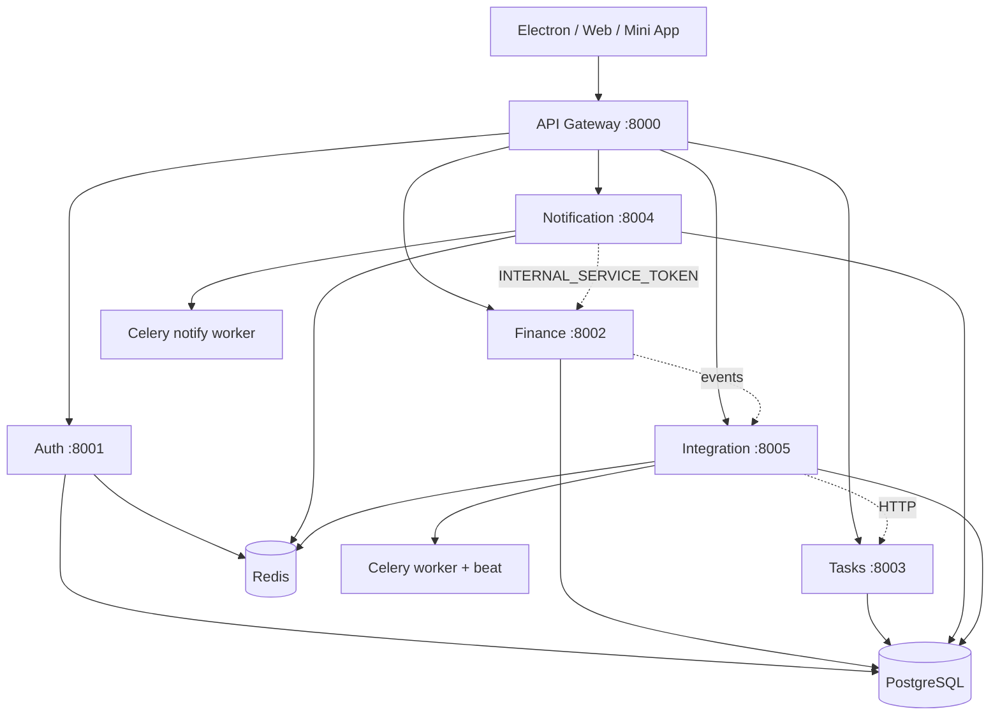

---
tags:
  - pah
  - architecture
---

# Архитектура

Клиенты ходят только в [[API Gateway]]. Gateway проверяет JWT, ограничивает частоту запросов и проксирует в микросервисы. Сервисы делят одну PostgreSQL и Redis; фоновые задачи — Celery.

![[assets/architecture.svg]]



## Маршрутизация gateway

| Клиентский путь | Upstream |
|-----------------|----------|
| `/auth/...` | Auth as-is |
| `/finance/api/...` | Finance `/api/...` |
| `/tasks/api/...` | Tasks `/api/...` |
| `/notification/api/...` | Notification `/api/...` |
| `/integration/api/...` | Integration `/api/...` |

### Proxy rewrite (фрагмент)

```python
# api-gateway/app/main.py
async def _proxy_rewrite(service_base: str, request: Request, strip_prefix: str) -> Response:
    full_path = request.url.path
    if full_path.startswith(strip_prefix):
        path = full_path[len(strip_prefix):]
    else:
        path = full_path
    target_url = f"{service_base}{path}"
    # ... httpx.request → Response
```

```python
@app.api_route("/finance/{path:path}", methods=["GET", "POST", "PUT", "PATCH", "DELETE", "HEAD"])
@limiter.limit("100/minute")
async def finance_proxy(request: Request, path: str):
    return await _proxy_rewrite(SERVICE_URLS["finance"], request, "/finance")
```

Публичные исключения (без JWT): `/auth/*`, health, docs, Telegram webhook и webapp-auth:

```python
# api-gateway/app/main.py — JWTAuthMiddleware
if path == "/notification/api/telegram/webhook":
    ...
if path == "/notification/api/telegram/webapp/auth":
    ...
```

## Связь сервис ↔ сервис

| Откуда | Куда | Зачем |
|--------|------|-------|
| Finance | Integration | события (например recurring payment) |
| Notification | Finance (internal API) | бот создаёт транзакции (`INTERNAL_SERVICE_TOKEN`) |
| Integration | Finance / Tasks | аналитика, автосоздание задач |
| Auth | Redis | blacklist JWT при logout |

### Event → задача

```python
# integration-service/app/main.py
@app.post("/api/events")
async def receive_event(event: EventPayload, request: Request):
    from app.tasks import auto_create_task_from_payment
    if event.event_type == "recurring_payment_created":
        auto_create_task_from_payment.delay(event.model_dump())
    return {"status": "received", "event_type": event.event_type}
```

## Данные

- Одна БД `personal_assistant_hub`, таблицы по сервисам
- Мультитенантность через `user_id` (без кросс-сервисных FK в runtime)
- Redis: кэш, blacklist токенов, брокер Celery (разные DB index)

## См. также

← [[Personal Assistant Hub]] · [[Стек технологий]] · [[Доменная модель]] · [[Скриншоты UI]]
