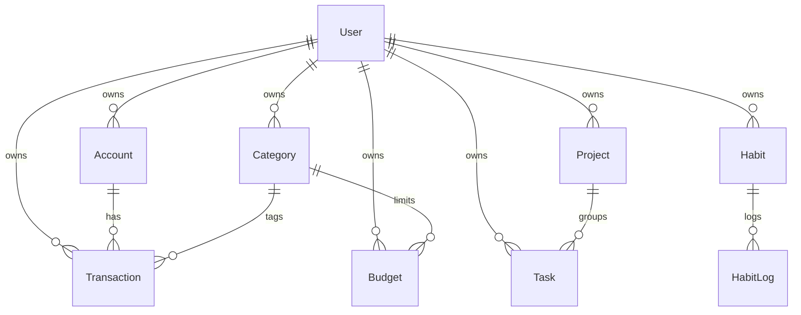

---
tags:
  - pah
  - domain
---

# Доменная модель

Сущности размазаны по сервисам; Settings — только в браузере (localStorage).



## Пользователь (Auth)
- email, username, password_hash
- role: `user` | `admin`
- is_active
- subscription: status (`free` / `trial` / `active` / …), plan, expires_at

## Финансы (Finance)

```python
# finance-service/app/models.py
class Account(Base):
    __tablename__ = "accounts"
    id: Mapped[int] = mapped_column(primary_key=True, autoincrement=True)
    user_id: Mapped[int] = mapped_column(Integer, nullable=False, index=True)
    name: Mapped[str] = mapped_column(String(128), nullable=False)
    type: Mapped[AccountType]  # CASH | BANK | CARD | SAVINGS
    balance: Mapped[Decimal] = mapped_column(Numeric(12, 2), default=Decimal("0.00"))
    currency: Mapped[str] = mapped_column(String(3), default="USD")

class Transaction(Base):
    __tablename__ = "transactions"
    # ... account_id, category_id, amount, transaction_type
    is_recurring: Mapped[bool] = mapped_column(Boolean, default=False)
    recurring_day: Mapped[int] = mapped_column(Integer, nullable=True)
```

## Задачи (Tasks)

```python
# tasks-service/app/models.py
class Project(Base):
    __tablename__ = "projects"
    name = Column(String(255), nullable=False)
    color = Column(String(7), default="#6366f1")

class Task(Base):
    __tablename__ = "tasks"
    project_id = Column(Integer, ForeignKey("projects.id", ondelete="SET NULL"), nullable=True)
    priority = Column(Enum("LOW", "MEDIUM", "HIGH", "CRITICAL", name="taskpriority"), default="MEDIUM")
    status = Column(Enum("TODO", "IN_PROGRESS", "DONE", name="taskstatus"), default="TODO")
    deadline = Column(DateTime(timezone=True), nullable=True)
    order_index = Column(Integer, default=0)

class Habit(Base):
    frequency = Column(Enum("DAILY", "WEEKLY", "MONTHLY", name="habitfrequency"), default="DAILY")
    times_per_day = Column(Integer, default=1)
    streak = Column(Integer, default=0)
```

## Уведомления
- **Notification** — запись канала (email / telegram / push)
- **TelegramLink** / **TelegramLinkToken** — привязка chat ↔ user

## Аналитика (Integration)
- **ProductivityReport** — корреляция задачи ↔ расходы + insight
- **BudgetForecast** — прогноз spend vs limit, risk `low`/`medium`/`high`

## Клиентские настройки
Ключ `pah_settings_{userId}` — см. [[Настройки]].

## См. также

← [[Personal Assistant Hub]] · [[Финансы]] · [[Задачи и проекты]] · [[Привычки]]
